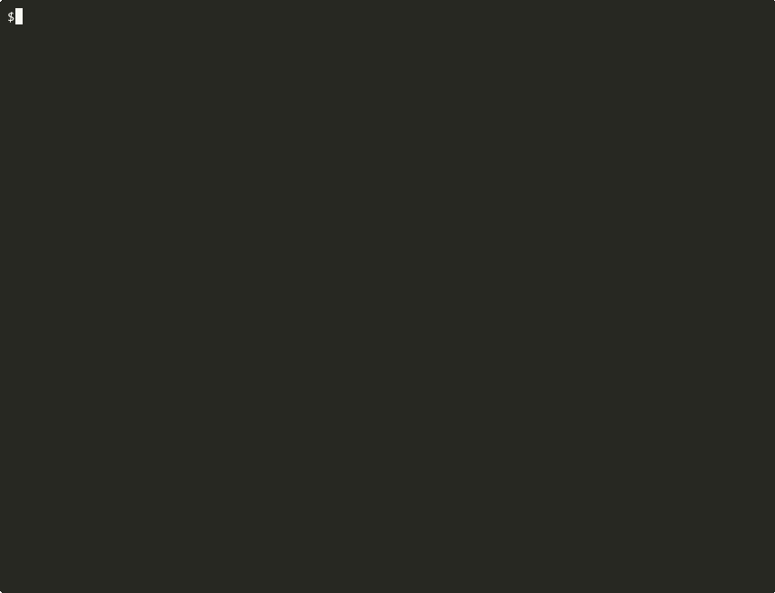

# Terminal.Gui.Cli

[](https://www.nuget.org/packages/Terminal.Gui.Cli)
[](LICENSE)

> A .NET library that turns [Terminal.Gui](https://github.com/gui-cs/Terminal.Gui) apps into scriptable CLI tools — with typed JSON output, POSIX exit codes, and built-in AI-agent discoverability.



## Why

Terminal.Gui gives you rich TUI applications. **Terminal.Gui.Cli** lets those same apps participate in scripts, pipelines, and agentic workflows — no separate CLI layer needed.

One NuGet package. One `CliHost`. All your views become commands.

## Features

| Capability | How |
|---|---|
| **CLI parsing** | Positional command dispatch, typed options, `--initial` pre-fill |
| **Structured output** | `--json` emits a versioned `JsonEnvelope` |
| **Headless rendering** | `--cat` renders viewer content without a TUI |
| **AI discoverability** | `--opencli` metadata + `agent-guide` embedded Markdown |
| **Built-in help** | `--help` via pluggable `IHelpProvider` |
| **Exit codes** | Deterministic POSIX codes from `CommandResult` |

## Quickstart

```sh
dotnet add package Terminal.Gui.Cli
```

```csharp
using Terminal.Gui.Cli;

CliHost host = new (options =>
{
    options.ApplicationName = "my-app";
    options.Version = "1.0.0";
});

host.Registry.Register (new GreetCommand ());

return await host.RunAsync (args);
```

Then run it:

```sh
my-app greet --initial "World"          # interactive TUI
my-app greet --initial "World" --json   # → {"schemaVersion":1,"status":"ok","value":"Hello, World!"}
my-app info --cat                       # headless viewer output
my-app --opencli                        # machine-readable command metadata
my-app agent-guide                      # embedded agent guidance (Markdown)
```

## Command model

| Kind | Interface | Description |
|------|-----------|-------------|
| **Input** | `ICliCommand<T>` | Launches a Terminal.Gui UI, returns a typed result |
| **Viewer** | `IViewerCommand` | Displays content; supports `--cat` for headless rendering |

Commands register explicitly (no reflection scanning) and resolve by case-insensitive alias.

## Global options

Every command inherits these from the host:

| Option | Description |
|--------|-------------|
| `--help` / `-h` | Show help |
| `--version` | Show version |
| `--opencli` | Emit OpenCLI metadata JSON |
| `--json` | Wrap output in JSON envelope |
| `--initial <value>` | Pre-fill input value (non-interactive mode) |
| `--timeout <duration>` | Cancel after duration (e.g., `30s`, `5m`) |
| `--output <path>` / `-o` | Write output to file |
| `--cat` | Headless render (viewer commands only) |

## Repository layout

```
src/          Terminal.Gui.Cli library
tests/        Unit, integration, and smoke tests
examples/     Example console app (see hero GIF above)
specs/        Constitution and library specification
scripts/      Tooling and recording scripts
docs/         Images and documentation assets
```

## Building from source

Requires **.NET 10 SDK**. Solution: `Terminal.Gui.Cli.slnx`.

```sh
dotnet restore Terminal.Gui.Cli.slnx
dotnet build   Terminal.Gui.Cli.slnx

# Run all test tiers
dotnet run --project tests/Terminal.Gui.Cli.Tests
dotnet run --project tests/Terminal.Gui.Cli.IntegrationTests
dotnet run --project tests/Terminal.Gui.Cli.SmokeTests

# Try the example app
dotnet run --project examples/Terminal.Gui.Cli.ExampleApp -- greet --initial "World" --json
```

## Status

**Alpha** — `0.1.0-develop` pre-release. API surface is stabilizing; breaking changes possible.

## Contributing

See [`specs/constitution.md`](specs/constitution.md) for architectural rules and PR requirements.

## License

MIT — see [`LICENSE`](LICENSE).
